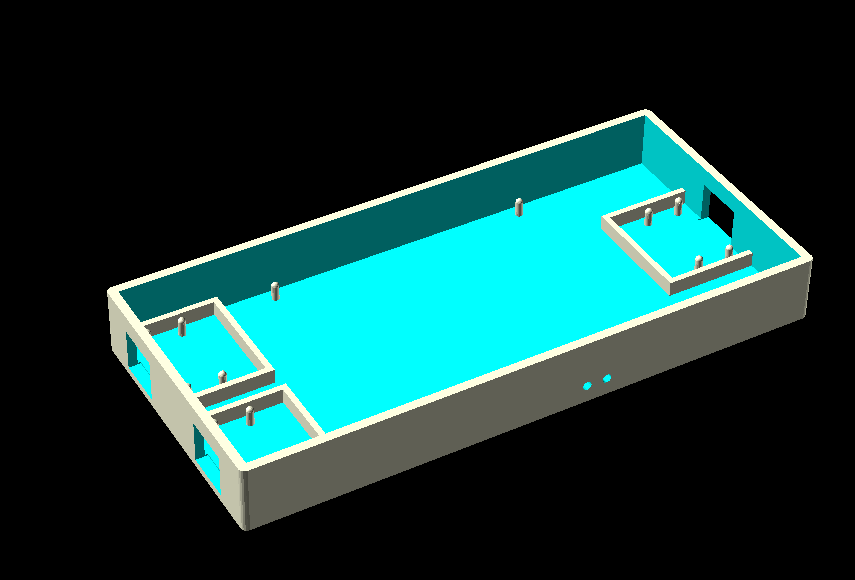
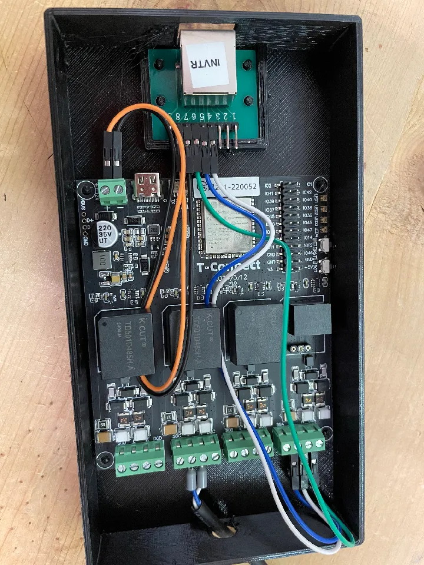
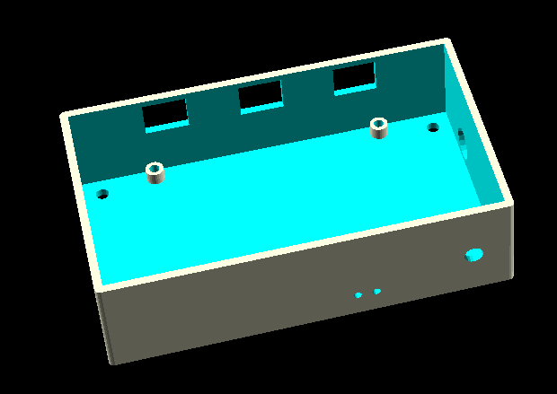
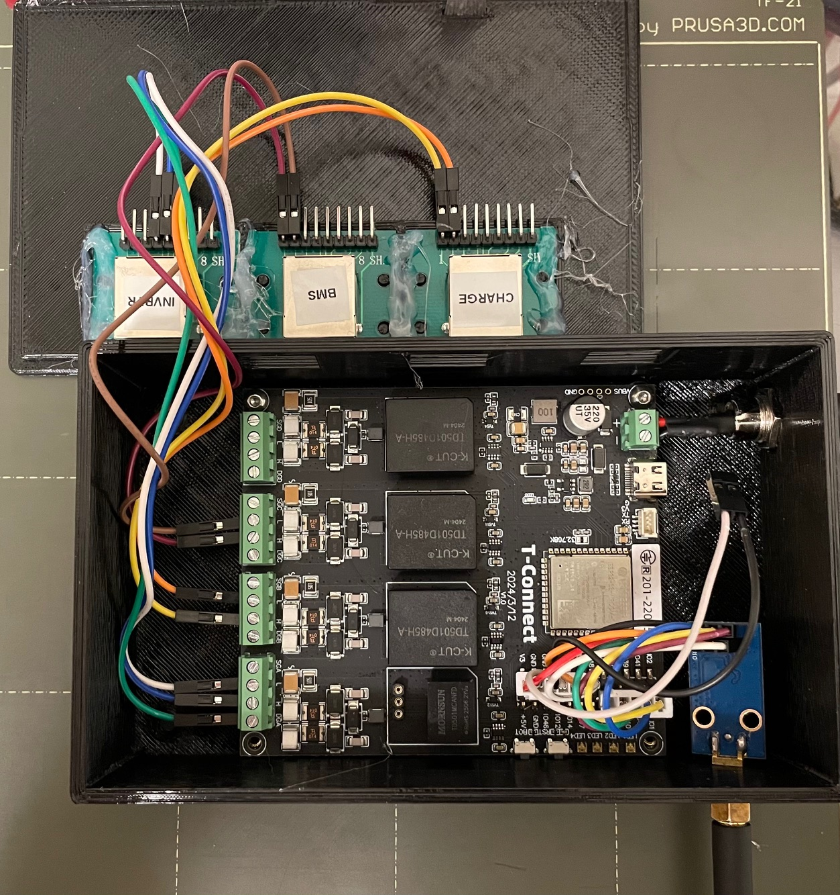
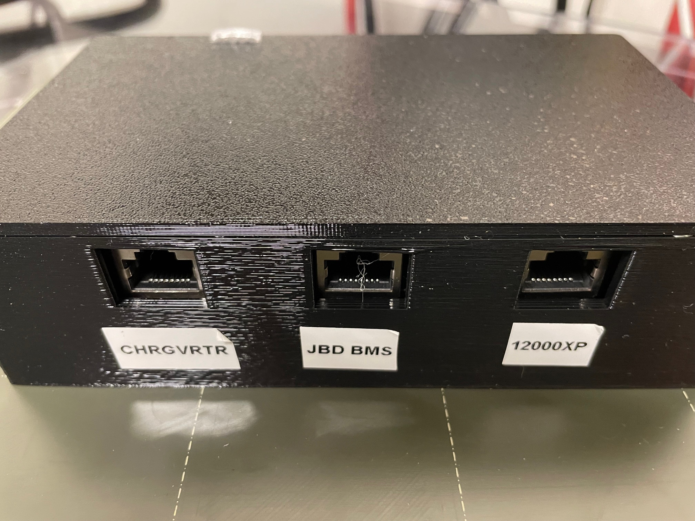

# LillyGo T-Connect ESP32 Enclosure

3D printable enclosure for the LillyGo T-Connect ESP32 board.

**LilyGo T-connect:** https://amzn.to/3Laaei9

**RJ45 Modules:** https://amzn.to/49rEJbe

**Dupont jumper wires** https://amzn.to/4pwAtx6 (use male to female jumpers to connect between the T-Connect terminal blocks and the rj45 modules)

**Dupont / JST crimping kit** https://amzn.to/4aNlICu (use JST-XH if you need to use the T-Connect header pins, they're too short for dupont)

**Power input connectors** https://amzn.to/49AZXn7 (if using the 12V input instead of USB)

**Inline fuse holders** https://amzn.to/4sBli8F (You probably want to use a 1A fuse if using the 12V input)

**Victron 48V -> 12V converter** https://amzn.to/4aPAysb (To power the t-connect directly from your battery)

## Getting Started

1. **Download OpenSCAD**: Visit [https://www.openscad.org/](https://www.openscad.org/)
2. **Open the file**: Launch OpenSCAD and open the `.scad` file for your chosen version
3. **Use Customizer** (Tall version only): Press `Alt+C` or go to `Window > Customizer` to adjust parameters
4. **Preview**: Press `F5` to preview the model
5. **Render & Export**: Press `F6` to render, then `File > Export > Export as STL...` to save

---

## Short Version

Simple open shell design with RJ45 modules mounted on the bottom.

**File:** `tconnect_enclosure_short.scad`

### Key Features
- Lower profile (22.5mm wall height)
- RJ45 modules on side walls
- Standard lid with pin guides
- Button holes for board buttons

### Printing & Export
1. Press `F6` to render
2. Go to `File > Export > Export as STL...`
3. Print enclosure and lid separately
4. Recommended: 0.2-0.3mm layer height, 20-30% infill, PLA or PETG

### Fit Adjustments
Edit parameters directly in the SCAD file:
- `lip_clearance`: Clearance between lid and walls (default: 0.2mm) - increase if lid is too tight
- `button1_from_power_side`: Button 1 position (default: 24mm)
- `button2_from_power_side`: Button 2 position (default: 31mm)

---

## Tall Version

Compact design with RJ45 modules mounted inverted in the lid.

**File:** `tconnect_enclosure_tall.scad`

### Key Features
- Taller profile (40mm wall height) for inverted RJ45 modules
- RJ45 modules mounted in lid (more compact footprint)
- Optional power and antenna holes
- Optional wall mounting holes
- LED viewing holes with optional light pipes
- Board mounting: pins or heat inserts

### Key Parameters (via Customizer)

**Rendering Options**
- `render_part`: Choose which part to export (Enclosure, Lid, or Light Pipes)
- `show_lid`: Show lid in preview when rendering enclosure
- `show_light_pipes`: Show light pipes in preview

**Optional Features**
- `enable_power_hole`: Enable/disable power input hole (default: true)
- `enable_antenna_hole`: Enable/disable antenna hole (default: false)
- `enable_mounting_holes`: Enable/disable wall mounting holes (default: true)

**Board Mounting**
- `use_heat_inserts`: Use heat inserts or pins (default: false)
- `board_pin_inset`: Distance from board edge to mount center (default: 3mm)

**RJ45 Modules**
- `rj45_module_count`: Number of modules (default: 3)
- `rj45_module_width`: Internal width (default: 34.5mm)
- `rj45_module_length`: Internal length (default: 29mm)

**Button & LED Holes**
- `button1_from_power_side`: Button 1 position from power side (default: 24mm)
- `button2_from_power_side`: Button 2 position from power side (default: 31mm)
- `led_hole_size`: Size of square LED holes (default: 2mm)
- `led_spacing`: Center-to-center spacing between LEDs (default: 3mm)

**Fit Adjustments**
- `lip_clearance`: Clearance between lid and walls (default: 0.2mm) - increase if lid is too tight
- `snap_tab_depth`: Snap tab interference depth (default: 0.7mm) - adjust if lid is too loose/tight

### Printing & Export
1. Set `render_part` to the component you want (Enclosure, Lid, or Light Pipes)
2. Press `F6` to render
3. Go to `File > Export > Export as STL...`
4. Print each part separately
5. Recommended: 0.2-0.3mm layer height, 20-30% infill, PLA or PETG
